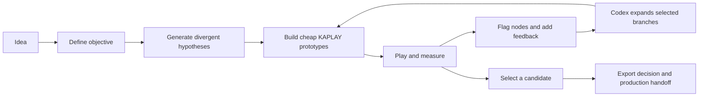
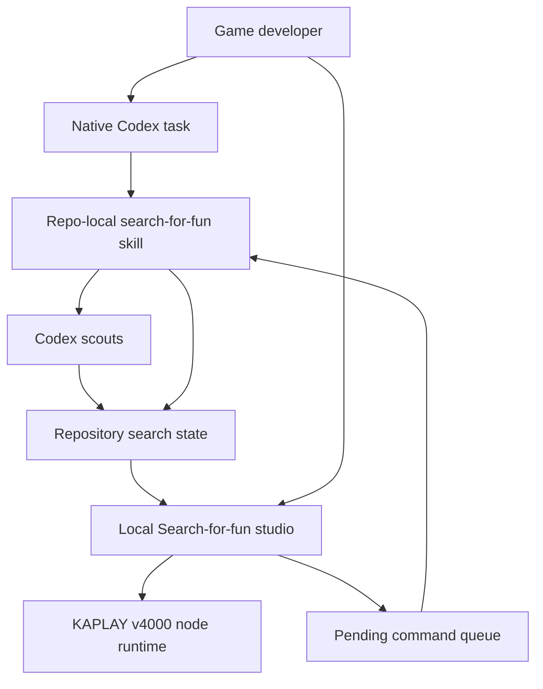

# Search-for-fun

## Local-first game design search with Codex!

**Document status:** Implemented local MVP, v1.0
**Date:** 2026-07-18  
**Working title:** Search-for-fun  
**Primary implementation target:** OpenAI Build Week project

---

## 0. Implementation snapshot

The local MVP described by this document is implemented in this repository. It includes the versioned file contract and JSON Schemas, atomic repository and command operations, a sandboxed host-owned KAPLAY runtime, the React exploration studio, the repo-local Codex skill and lifecycle scripts, automated unit and integration coverage, and a canonical four-node lighthouse search with captured browser previews and playtest evidence.

The implemented first round treats the objective as the virtual graph root and creates three parentless playable root nodes: readable, adjacent, and leap. A later crossover node has both the readable and adjacent nodes as parents. This resolves earlier wording that implied a separate playable “root node.”

Run `npm run check` for the complete automated verification pass and `npm run dev` to use the local studio at `http://127.0.0.1:4317`.

---

## 1. Executive summary

Search-for-fun is a forkable repository that helps an indie game developer search for fun instead of committing prematurely to the first plausible game design.

The developer starts with an idea in Codex. A repository-local skill turns that idea into an explicit search objective, creates several deliberately different hypotheses, and uses Codex scouts to produce small playable KAPLAY prototypes. A local studio renders every prototype through a consistent shell, visualizes the exploration graph, captures playtest feedback, and lets the developer flag one or more nodes for further exploration. The developer continues to reason and communicate in the native Codex task; the studio is the durable visual and playtest surface.

Every search, prototype, decision, measurement, and rejected direction is stored as inspectable files in the repository. A completed node is never silently overwritten. Refinement produces a child node, crossover can produce a node with multiple parents, and an old branch can be resumed after the original Codex conversation is gone.

The product is intentionally local-first:

- The repository is the database and portable project format.
- A repo-local Codex skill is the search controller.
- A small local studio is the graph, player, and evaluation UI.
- KAPLAY v4000 is the standardized prototype runtime.
- Git provides history and recovery around the search graph.
- Native Codex remains the conversational and agentic interface.

The MVP is not a cloud platform, a general game engine, or an autonomous judge of fun. It is a smooth, inspectable loop for generating alternatives, playing them, recording evidence, and steering the next search.

---

## 2. Context

### 2.1 Game design is a search problem

Making a game can be modeled as searching a large, noisy, multidimensional design space. Each prototype is a measurement of a location in that space. The quality of the final game depends not only on execution quality, but on:

- which directions were explored;
- how cheaply they were explored;
- when the team widened or narrowed its search;
- whether it made occasional large jumps;
- what it chose to measure;
- how it handled contradictory or noisy measurements; and
- whether it could revisit an abandoned direction without rebuilding it from memory.

Traditional development encourages a largely linear path: choose an idea, create a project, improve it, and polish it. This path feels productive because little work is discarded, but it can efficiently optimize a weak local minimum.

The preferred strategy for indie game projects is usually wide first and narrow later:

1. Define what the search is optimizing.
2. Explore several materially different hypotheses.
3. Build the cheapest prototypes that can produce useful measurements.
4. Play and evaluate them.
5. Refine promising branches.
6. Occasionally make a low-cost leap away from the current best branch.
7. Commit to production only after the direction has earned that investment.

### 2.2 Coding agents reduce exploration cost

Coding agents make implementation dramatically cheaper, but most agent workflows remain single-path. A user asks for a game and receives one interpretation. Follow-up prompts refine that implementation, which makes the agent an effective local optimizer but does not guarantee that it explored the right design direction.

Codex creates an opportunity to change the interaction model. Independent scouts can investigate different mechanics, control schemes, pacing models, or fantasies. The primary agent can preserve the objective, compare results, and coordinate subsequent rounds. The same capability that makes software production faster can make design exploration wider, provided the workflow deliberately values alternatives and discarded work.

### 2.3 The missing durable artifact

A conversation is not an adequate canonical representation of a design search:

- Old prototypes become difficult to find.
- Branch relationships are implicit.
- Feedback is mixed into prose.
- The search becomes dependent on chat history and context.
- A developer cannot reliably reopen an old branch months later.
- Agents may reinterpret prior decisions rather than reading an explicit record.

Search-for-fun therefore stores the search as a local, versionable graph. Conversations operate on that graph, but do not own it.

### 2.4 Why KAPLAY v4000

Search-for-fun needs prototypes that are fast to generate, immediately playable in a browser, easy to isolate, and consistent enough to render through one studio. KAPLAY is well suited to this role.

The v4000 API supports:

- npm and JavaScript-module usage;
- initialization against a supplied canvas or root element;
- non-global contexts through `global: false`;
- an explicit `quit()` lifecycle;
- semantic button bindings across keyboard and gamepad;
- screenshots and browser-native rendering; and
- a compact component-oriented API that agents can produce quickly.

At the time of this design, the official v4000 documentation identifies `4000.0.0-alpha.27.1`. Because this is an alpha line, Search-for-fun will pin the exact package version and isolate KAPLAY-specific setup behind a small runtime adapter. Prototype nodes will target the Search-for-fun game contract, not arbitrary engine initialization.

---

## 3. Problem

### 3.1 Primary problem statement

Game developers lack a smooth way to use coding agents as an explicit design-search process while preserving every branch, prototype, measurement, and decision in a form that is playable, navigable, and resumable.

### 3.2 User problems

#### Premature convergence

The developer invests in the first promising idea because producing alternatives is expensive and comparing them is awkward.

#### Invisible local minima

Iterative improvement can make a weak direction feel increasingly convincing. Small adjustments do not reveal stronger but more distant designs.

#### Expensive branching

Creating another project, recreating shared setup, wiring controls, running servers, and preserving versions imposes enough friction that many experiments never happen.

#### Fragmented evaluation

Game code, screenshots, written feedback, telemetry, and design rationale live in different places. The developer cannot see the complete evidence for a branch at a glance.

#### Lost negative knowledge

Rejected ideas and the reasons they failed are rarely preserved. Future agents or collaborators repeat those experiments or misunderstand deliberate decisions.

#### Conversation dependence

The project becomes dependent on one long chat. When the task is closed or context becomes noisy, the design history becomes hard to reconstruct.

#### Tool switching

A developer may need to alternate between chat, terminal, file browser, game window, notes, and version-control UI. Each transition weakens the search loop.

### 3.3 Jobs to be done

When I have a game idea, help me turn it into several testable design hypotheses so I do not overinvest in the first one.

When I play a prototype, let me capture what felt good or bad while the experience is fresh and attach that feedback to the correct node.

When I find multiple promising directions, let me expand them in parallel without losing their ancestry or mixing their implementations.

When I return later, show me what was explored, what was measured, what was rejected, and where I should continue without requiring the original conversation.

When I choose a direction, give me a clean candidate and a durable record of why it won.

---

## 4. Proposed solution

### 4.1 Product definition

Search-for-fun is a repository template containing:

1. a canonical file format for searches and nodes;
2. a repo-local Codex skill that implements the search workflow;
3. a standardized KAPLAY v4000 prototype contract;
4. a local studio for graph navigation, live playtesting, and evaluation;
5. a command queue that turns studio flags into agent work; and
6. validation, screenshot, and checkpoint tooling.

### 4.2 Core loop



### 4.3 Product thesis

The central product is not an AI game generator. Codex can already generate game code. The product is the persistent search process around generation:

- explicit objectives;
- divergent branches;
- cheap playable measurements;
- visible ancestry;
- human steering;
- local memory; and
- disciplined convergence.

### 4.4 Experience summary

The developer forks Search-for-fun, opens it in Codex, and says:

```text
$search-for-fun Start a search for a one-button game about keeping a lighthouse alive during a storm.
```

The skill asks only questions whose answers materially affect the search, creates the root search record, and launches a first exploration round. When the scouts finish, the studio shows the new nodes. The developer plays each prototype under the same top bar, records feedback, and flags one or more nodes.

The developer returns to Codex and says:

```text
$search-for-fun Continue the flagged branches.
```

The skill reads the pending commands and recorded evidence, creates the next nodes, and updates the search. Any future Codex task can resume the same search from files.

---

## 5. Goals and non-goals

### 5.1 Goals

- Make exploring three directions feel nearly as easy as asking for one.
- Preserve every completed prototype as a playable node.
- Make branch ancestry and evaluation evidence immediately understandable.
- Keep subjective judgment with the human while giving the human better evidence.
- Allow multiple nodes to be selected and expanded in one round.
- Make the search resumable without chat history.
- Keep setup, state, and execution local and inspectable.
- Use native Codex for conversation and agent orchestration.
- Use one constrained KAPLAY runtime so generated prototypes launch reliably.
- Produce a convincing end-to-end experience without accounts, cloud storage, or deployment.

### 5.2 Non-goals for the MVP

- Replacing a production game engine or full development environment.
- Automatically deciding which game is fun.
- Generating production-ready art and gameplay simultaneously.
- Supporting arbitrary JavaScript frameworks or engines inside nodes.
- Cloud synchronization, multiplayer collaboration, or hosted galleries.
- A public plugin marketplace release.
- Directly merging a prototype into an external production game.
- Automatically committing or pushing changes without an explicit user request.
- Continuous autonomous searching without human evaluation checkpoints.
- Training or fine-tuning a model from playtest data.

---

## 6. Design principles

### 6.1 Search before polish

The system rewards multiple cheap measurements before deep investment.

### 6.2 The human defines depth

Search-for-fun must learn what the developer is optimizing. The system can structure evidence and challenge inconsistencies, but it does not replace subjective creative judgment.

### 6.3 Every completed branch remains inspectable

Refinement creates a child. It does not mutate history.

### 6.4 The repository is canonical

The dashboard, Codex skill, and future integrations are projections and operators over files. No essential state exists only in a browser database or conversation.

### 6.5 Graph semantics do not depend on Git semantics

Node ancestry is represented in node metadata. Git records repository history; branches and commits are not used as the primary search graph.

### 6.6 Prototype constraints create speed

Every node uses a shared runtime, fixed dependency set, clear entry point, and limited scope. Scouts are encouraged to discard clean architecture in their internal implementation, but not to break the prototype contract.

### 6.7 Separate evidence from interpretation

Telemetry, human ratings, notes, and agent critiques are stored as distinct evidence. A later synthesis can interpret them without obscuring their sources.

### 6.8 Explicit checkpoints over invisible autonomy

The developer chooses when flagged branches are expanded. The MVP does not watch the filesystem and silently start new agent work.

### 6.9 Smoothness comes from continuity

The same shell, controls, node identity, and feedback flow appear for every prototype. A lightweight tool can feel holistic when transitions are predictable.

---

## 7. Target users

### 7.1 Primary persona

A solo or small-team game developer who can describe desired feelings and fantasies but wants help exploring mechanics rapidly. They are comfortable using Codex and running a local development server, but should not need to understand Search-for-fun internals.

### 7.2 Secondary persona

A creative technologist or game-jam participant exploring browser-game ideas under a severe time constraint.

### 7.3 Team persona, later

A small game team that wants designers, engineers, and artists to share an explicit design tree and attach feedback without collapsing every idea into one production branch.

---

## 8. User experience

### 8.1 First-run experience

1. Fork or copy the Search-for-fun repository.
2. Install dependencies.
3. Open the repository in Codex.
4. Invoke `$search-for-fun` with an idea.
5. The skill verifies the repository and runtime.
6. The skill conducts a short objective interview.
7. The search and first objective revision are created.
8. Three scouts build the first parentless playable alternatives.
9. The studio opens or the user runs the documented studio command.

The first interview should normally ask no more than three questions. Candidate dimensions include:

- desired player feeling;
- target session length;
- primary input constraint;
- intended audience;
- fantasy or role;
- scope limit; and
- what would make the first playtest successful.

### 8.2 Studio layout

The studio is one local web surface with four stable regions:

#### Persistent top bar

- Search name and ID
- Current node ID
- Parent breadcrumb
- Node status
- Play/restart
- Flag for expansion
- Reject/archive
- Compare
- Resume in Codex

#### Exploration graph

- Nodes arranged primarily by generation
- Directed edges representing derivation
- Visible edge type
- Current selection
- Status and evidence indicators

#### Play surface

- Sandboxed KAPLAY game
- Standard viewport and focus behavior
- Restart control
- Optional instructions overlay
- Session timer
- Error state if the node fails to boot

#### Evaluation surface

- Quick structured ratings
- Freeform observation
- What should be preserved
- What should change
- Desired next move
- Prior playtest sessions

The MVP may collapse the graph and evaluation surface into drawers on narrow widths. The play surface remains primary.

### 8.3 Node actions

- **Play:** Load or focus the node.
- **Restart:** Reset the play session with the recorded seed.
- **Flag:** Add the node to the next expansion command.
- **Expand:** Request children from only this node.
- **Leap:** Request a deliberately distant reinterpretation based on the search objective.
- **Compare:** Place two nodes into a controlled comparison session.
- **Cross:** Request a child with two or more parents and an explicit synthesis instruction.
- **Reject:** Record why the node should not be pursued.
- **Archive:** Hide the node from the default graph without deleting it.
- **Favorite:** Mark a strong reference without necessarily selecting it for expansion.

### 8.4 Continuing from flags

Flagging nodes writes a pending command file. It does not directly invoke Codex. The top bar then shows a concise call to action:

```text
2 nodes ready to expand · Continue in Codex
```

For the current task, the user can simply say “continue the flagged branches.” For a later session, the studio can open a new Codex task with the repository path and a prefilled resume prompt. The prompt is not sent automatically.

### 8.5 Resuming later

When a search is reopened, the studio reconstructs it from files. Codex runs a resume procedure that reads:

- the search objective and constraints;
- the latest event cursor;
- node metadata and status;
- pending commands;
- evaluation summaries;
- rejected directions; and
- unresolved questions.

The original conversation is optional context, not a dependency.

### 8.6 Selecting a winner

Selecting a candidate does not delete alternatives. The skill produces:

- the selected node ID;
- a concise decision record;
- evidence that supported the selection;
- known weaknesses;
- mechanics or qualities to preserve;
- rejected alternatives and reasons;
- recommended production risks to investigate; and
- an export or handoff plan.

---

## 9. Search model

### 9.1 Terms

**Search:** One game idea and its complete exploration graph.

**Objective:** The definition of what the search is optimizing, including constraints and evaluation rubric.

**Node:** One immutable, runnable prototype artifact plus its design hypothesis and provenance. A search can have multiple parentless root nodes.

**Edge:** A typed relationship from one or more parent nodes to a child.

**Generation:** A loose search round used for layout and coordination; it is not required to be a strict tree depth.

**Evaluation:** Human feedback, observed telemetry, technical validation, or agent critique attached to a node.

**Command:** A durable user request written by the studio for Codex to process.

**Scout:** A bounded agent tasked with producing or evaluating one search branch.

**Seal:** The transition after which a node's design document and game artifact are not edited in place.

### 9.2 Edge types

- `root`: a parentless first-round playable interpretation beneath the virtual objective root;
- `refine`: local improvement preserving the parent's core hypothesis;
- `branch`: adjacent alternative changing one major dimension;
- `leap`: deliberate high-distance experiment;
- `crossover`: synthesis with multiple parents;
- `reframe`: new objective or fantasy applied to an existing mechanic;
- `art-study`: presentation exploration without claiming a gameplay measurement; and
- `system-study`: isolated mechanic or economy experiment.

### 9.3 Default first-round strategy

The first round creates three nodes:

1. **Readable:** the most legible, conventional interpretation near known successful patterns.
2. **Adjacent:** a meaningful variation that changes a central mechanic or control model.
3. **Leap:** a distant but cheap interpretation designed to escape the first local minimum.

The labels describe search roles, not quality rankings.

### 9.4 Default narrowing strategy

After evaluation:

- expand no more than two strong branches by default;
- preserve at least one unresolved alternative;
- ask what specifically should survive into the next generation;
- let a scout critique or extend a branch it did not originate when practical; and
- offer a leap after two consecutive refinement-only rounds.

### 9.5 Objective changes

Changing the objective is a first-class event. Material objective changes create a new objective revision. Existing node evaluations retain the objective revision under which they were recorded.

---

## 10. System architecture



### 10.1 Architectural boundaries

#### Repository: source of truth

Owns objectives, nodes, events, evaluations, commands, assets, schemas, and generated summaries.

#### Skill: control plane

Owns the workflow, questions, search strategy, scout briefs, command consumption, validation sequence, and synthesis behavior.

#### Studio: projection and input surface

Reads repository state, renders the graph, plays nodes, captures evidence, and writes narrowly scoped commands and evaluations.

#### KAPLAY runtime: prototype execution boundary

Provides a stable adapter, canvas lifecycle, input bindings, playtest API, and instrumentation contract.

#### Codex: conversation and execution

Interprets intent, coordinates agents, edits files, runs validation, and explains results. Search-for-fun does not rebuild chat.

### 10.2 Why the MVP is not a plugin

A forked repository can include its own skill under `.agents/skills`, helper scripts, studio, schemas, and instructions. That provides a zero-marketplace path and keeps the project self-contained.

A plugin is a later distribution unit if Search-for-fun needs to:

- install into arbitrary existing repositories;
- bundle hooks or MCP configuration;
- expose an MCP-backed embedded UI;
- ship updates independently of the template; or
- appear in a plugin directory.

The internal skill and file format should remain usable without plugin packaging.

### 10.3 Why worktrees are not canonical storage

Worktrees may isolate scout implementation, but they are execution environments rather than the durable search model. A validated scout result is imported into a canonical node folder. The MVP can avoid worktrees entirely by assigning scouts unique staging directories.

---

## 11. Repository layout

```text
search-for-fun/
├── AGENTS.md
├── README.md
├── package.json
├── package-lock.json
├── tsconfig.json
├── vite.config.ts
│
├── .agents/
│   └── skills/
│       └── search-for-fun/
│           ├── SKILL.md
│           ├── references/
│           │   ├── search-strategy.md
│           │   ├── prototype-contract.md
│           │   └── evaluation-guide.md
│           └── scripts/
│               ├── create-search.ts
│               ├── import-node.ts
│               ├── validate-search.ts
│               ├── claim-command.ts
│               ├── complete-command.ts
│               ├── fail-command.ts
│               └── summarize-search.ts
│
├── schemas/
│   ├── search.schema.json
│   ├── objective.schema.json
│   ├── node.schema.json
│   ├── command.schema.json
│   ├── event.schema.json
│   ├── evaluation.schema.json
│   └── scout-result.schema.json
│
├── studio/
│   ├── client/
│   │   ├── graph.tsx
│   │   ├── player-frame.tsx
│   │   ├── evaluation-panel.tsx
│   │   └── app.tsx
│   ├── server/
│   │   ├── app.ts
│   │   ├── repository.ts
│   │   ├── safe-fs.ts
│   │   └── security.ts
│   └── runtime/
│       ├── create-kaplay-runtime.ts
│       ├── contract.ts
│       ├── player-host.ts
│       └── input.ts
│
├── searches/
│   └── s_20260719_lighthouse/
│       ├── search.json
│       ├── objectives/
│       │   └── rev_0001.json
│       ├── events.jsonl
│       ├── summary.md
│       ├── commands/
│       │   ├── pending/
│       │   ├── processing/
│       │   └── processed/
│       ├── evaluations/
│       │   └── sessions/
│       └── nodes/
│           ├── n_0000_beam_rhythm/
│           │   ├── node.json
│           │   ├── hypothesis.md
│           │   ├── game/
│           │   │   ├── index.ts
│           │   │   └── assets/
│           │   ├── evaluation/
│           │   │   ├── summary.json
│           │   │   └── agent-critiques/
│           │   └── preview.png
│           └── n_0001_rhythm/
│               └── ...
│
└── .search-for-fun/
    ├── staging/
    ├── locks/
    └── cache/
```

`.search-for-fun/staging` and `.search-for-fun/cache` are disposable and ignored by Git. Canonical searches are committed under `searches/`.

---

## 12. Data model

### 12.1 Search record

`search.json` owns stable search-level configuration.

```json
{
  "schemaVersion": 1,
  "id": "s_20260719_lighthouse",
  "title": "Lighthouse in a Storm",
  "status": "exploring",
  "phase": "exploration",
  "createdAt": "2026-07-19T20:00:00Z",
  "updatedAt": "2026-07-19T20:00:00Z",
  "engine": {
    "name": "kaplay",
    "version": "4000.0.0-alpha.27.1"
  },
  "activeObjectiveRevision": 1,
  "nextNodeSequence": 4
}
```

Objective revisions are immutable records under `objectives/`. For example, `objectives/rev_0001.json` contains the `searchId`, revision, creation time, success mode, fantasy, desired feelings, session range, constraints, rubric, and optional references, avoidance patterns, and innovation target.

### 12.2 Node record

```json
{
  "schemaVersion": 1,
  "id": "n_0002_resource_loop",
  "searchId": "s_20260719_lighthouse",
  "parents": ["n_0000_beam_rhythm"],
  "generation": 1,
  "edgeType": "branch",
  "searchRole": "adjacent",
  "lifecycleStatus": "sealed",
  "objectiveRevision": 1,
  "createdAt": "2026-07-19T20:18:00Z",
  "sealedAt": "2026-07-19T20:25:00Z",
  "title": "Resource Loop",
  "hypothesis": "Managing light, heat, and power will create meaningful short-session tension.",
  "changesFromParents": [
    "replaces timing mechanic with three-resource allocation"
  ],
  "preserve": [
    "single-screen lighthouse fantasy",
    "one-minute session target"
  ],
  "provenance": {
    "briefId": "first-round-adjacent",
    "report": "Tests a shared-resource decision loop."
  },
  "runtime": {
    "entry": "game/index.ts",
    "viewport": { "width": 960, "height": 540 },
    "orientation": "landscape",
    "seed": 41832,
    "actions": ["primary", "restart"]
  },
  "validation": {
    "schema": "passed",
    "typecheck": "passed",
    "bundle": "passed",
    "boot": "passed",
    "consoleErrors": 0,
    "screenshot": "preview.png"
  }
}
```

### 12.3 Evaluation event

Raw evaluations are append-only and retain their source.

```json
{
  "schemaVersion": 1,
  "id": "ev_01",
  "type": "human_playtest",
  "searchId": "s_20260719_lighthouse",
  "nodeId": "n_0002_resource_loop",
  "objectiveRevision": 1,
  "createdAt": "2026-07-19T20:31:00Z",
  "session": {
    "id": "session_20260719_01",
    "durationSeconds": 74,
    "restarts": 3,
    "completed": true
  },
  "ratings": {
    "fun": 4,
    "appeal": 4,
    "readability": 2,
    "fantasyFit": 5,
    "scopeConfidence": 3
  },
  "preserve": "The beam visibly weakening as power drops.",
  "change": "The three meters are too difficult to parse while playing.",
  "note": "Try one shared resource with more physical consequences."
}
```

### 12.4 Pending command

```json
{
  "schemaVersion": 1,
  "id": "cmd_20260719_203400_01",
  "type": "expand",
  "searchId": "s_20260719_lighthouse",
  "nodeIds": ["n_0001_rhythm", "n_0002_resource_loop"],
  "mode": "parallel",
  "instruction": "Preserve n_0001's readable timing, but test n_0002's visible power consequence.",
  "createdAt": "2026-07-19T20:34:00Z",
  "createdBy": "studio",
  "status": "pending"
}
```

### 12.5 Search event log

`events.jsonl` provides a compact, append-only chronology for resume and audit. Examples include:

- `search_created`
- `objective_revised`
- `exploration_started`
- `node_imported`
- `node_sealed`
- `node_validation_failed`
- `evaluation_recorded`
- `command_queued`
- `command_claimed`
- `command_completed`
- `candidate_selected`
- `search_archived`

The repository layer is the only writer to `events.jsonl`. Studio API writes and controller commands both pass through that layer, which serializes mutations with a per-search lock and records their accepted events.

### 12.6 Data invariants

- Search and node IDs are unique and never reused.
- Parent nodes must exist in the same search.
- A node may not be its own ancestor.
- A sealed node's `hypothesis.md`, `game/`, and core `node.json` fields are immutable.
- New feedback can be appended after sealing.
- Every playable node must declare one runtime entry.
- Every node references the objective revision used to create and evaluate it.
- Every completed command moves from `pending` to `processed` without changing its ID.
- No canonical path is derived from user-provided strings without sanitization.
- The graph must remain acyclic in the MVP.

---

## 13. KAPLAY v4000 prototype runtime

### 13.1 Version policy

The initial implementation pins:

```json
{
  "kaplay": "4000.0.0-alpha.27.1"
}
```

The package lock is committed. Automated dependency upgrades must not change the KAPLAY major, prerelease, or exact version. An upgrade requires:

1. adapter compatibility review;
2. contract test execution against fixture nodes;
3. visual smoke tests;
4. lifecycle and input verification; and
5. an explicit engine migration event.

### 13.2 Runtime initialization

The host, not the prototype, initializes KAPLAY:

```ts
import kaplay, { type KAPLAYCtx } from "kaplay";

export function createKaplayRuntime(canvas: HTMLCanvasElement): KAPLAYCtx {
  return kaplay({
    global: false,
    canvas,
    width: 960,
    height: 540,
    letterbox: true,
    focus: true,
    debug: false,
    buttons: DEFAULT_BUTTONS,
  });
}
```

The exact TypeScript types will be verified against the pinned package during implementation. Prototype code receives the context and never calls `kaplay()` itself.

### 13.3 Game module contract

Every playable node exports one definition:

```ts
import type { KAPLAYCtx } from "kaplay";
import type { SearchForFunGame, PlaytestApi } from "@search-for-fun/runtime";

const game: SearchForFunGame = {
  id: "n_0002_resource_loop",
  title: "Resource Loop",
  instructions: "Press or click to redirect power to the lighthouse beam.",

  mount(k: KAPLAYCtx, playtest: PlaytestApi) {
    playtest.ready();

    // Prototype implementation.

    return () => {
      // Dispose non-KAPLAY resources owned by this node.
    };
  },
};

export default game;
```

The player performs teardown in this order:

1. call the node cleanup function;
2. flush pending playtest events;
3. call `k.quit()`;
4. remove the iframe or canvas; and
5. revoke temporary object URLs.

### 13.4 Isolation strategy

Each active node runs in a sandboxed iframe served by the local studio. The iframe allows scripts but does not receive `allow-same-origin`; node bundles are served with the narrow headers needed to load under that opaque origin. This provides:

- CSS and DOM isolation;
- a fresh KAPLAY context;
- predictable keyboard focus;
- simple teardown on navigation;
- containment of prototype-level errors; and
- the ability to compare two nodes without sharing engine globals.

The iframe receives only its node ID, a short-lived playtest session ID, and a per-session nonce. It communicates with the parent through a validated `postMessage` protocol. Because a sandboxed iframe without `allow-same-origin` reports an opaque origin, the parent validates the exact `contentWindow`, nonce, session ID, and message schema rather than trusting an origin string alone.

### 13.5 Input contract

The runtime defines semantic actions through KAPLAY v4000 button bindings:

- `primary`
- `secondary`
- `left`
- `right`
- `up`
- `down`
- `pause`
- `restart`

Initial prototypes should prefer `primary` and directional actions over raw key names. The host maps keyboard, pointer, touch, and gamepad where practical. Node instructions are generated from declared actions.

### 13.6 Viewport policy

- Default logical viewport: 960 × 540.
- Letterboxing preserves aspect ratio.
- The studio may scale the iframe visually, but the prototype retains logical dimensions.
- Compare mode runs at reduced visual size without changing game coordinates.
- Pixel-art nodes may request crisp rendering through validated runtime options.
- A node may request portrait orientation, but the first MVP demo targets landscape.

### 13.7 Asset policy

- Node assets live under the node's `game/assets/` directory.
- Remote runtime asset URLs are forbidden by default.
- Shared approved primitive assets may live under `studio/runtime/assets/`.
- Node asset names are namespaced by node ID at load time.
- Each node declares asset licenses or origin when externally sourced.
- First-round scouts should prefer generated geometry, text, and simple local sounds over asset-heavy presentation.

### 13.8 Playtest API

The game may emit a small vocabulary of events:

```ts
interface PlaytestApi {
  ready(): void;
  start(): void;
  event(name: string, properties?: Record<string, JsonValue>): void;
  fail(reason?: string): void;
  complete(properties?: Record<string, JsonValue>): void;
  restart(): void;
}
```

Reserved event names include:

- `first_input`
- `decision`
- `damage`
- `death`
- `goal`
- `round_end`
- `tutorial_dismissed`

Telemetry is local, documented, and attached to a playtest session. It is evidence, not an automatic fun score.

### 13.9 Preview generation

After a node boots successfully, validation captures a representative screenshot. The MVP can use KAPLAY's screenshot capability or browser automation. The node's `preview.png` is canonical evidence and the graph thumbnail.

---

## 14. Codex skill design

### 14.1 Location and invocation

The repository includes `.agents/skills/search-for-fun/SKILL.md`, making the workflow discoverable within the forked project.

Expected invocations include:

```text
$search-for-fun Start: <idea>
$search-for-fun Continue the flagged branches
$search-for-fun Resume <search-id>
$search-for-fun Compare <node-id> and <node-id>
$search-for-fun Make a leap from <node-id>
$search-for-fun Cross <node-id> with <node-id>
$search-for-fun Select <node-id> as the candidate
```

These are natural-language patterns, not a custom parser requirement.

### 14.2 Skill responsibilities

- Verify repository structure and runtime health.
- Identify or create the active search.
- Interview for missing objective information.
- Translate intent into a versioned objective and rubric.
- Select a search strategy appropriate to the current phase.
- Generate bounded scout briefs.
- Assign unique staging directories.
- Validate and import results.
- Seal successful nodes.
- Record failures without promoting broken nodes.
- Consume pending commands safely and idempotently.
- Summarize new evidence and unresolved uncertainty.
- Produce a clean handoff when a candidate is selected.

### 14.3 Scout brief contract

Every implementation scout receives:

- one hypothesis;
- parent node IDs and allowed source material;
- the current objective revision;
- explicit dimensions to preserve and change;
- a time/scope budget;
- a unique staging directory;
- the KAPLAY prototype contract;
- allowed dependencies;
- required validation commands; and
- a required report describing what the prototype actually tests.

Scouts do not write search-level indexes, events, or commands. The primary controller validates and imports their output.

### 14.4 Agent roles

The MVP can use the same general Codex agent with different briefs. Conceptual roles are:

- **Objective interviewer:** finds missing criteria and tacit constraints.
- **Readable scout:** explores a legible, lower-risk branch.
- **Adjacent scout:** changes one central design dimension.
- **Leap scout:** attempts a distant, cheap alternative.
- **Contract reviewer:** verifies that a prototype measures its claimed hypothesis.
- **Runtime validator:** builds, boots, and checks the node.
- **Synthesizer:** compares evidence and proposes next branches without selecting on the user's behalf.

### 14.5 Command processing

The controller claims commands using an atomic move from `pending/` to `processing/`. Processing is idempotent:

- A command with an existing completion event is not rerun.
- Invalid commands are retained with an error result.
- Partial scout results remain in staging until explicitly retried or discarded.
- Completed commands move to `processed/` and receive a result summary.

### 14.6 Context discipline

The main task retains the objective, decisions, and synthesis. Scouts receive bounded context and return concise result manifests. Raw build logs and exploratory output do not become the canonical search narrative.

---

## 15. Local studio design

### 15.1 Technology

- TypeScript
- Vite development and build pipeline
- React for the studio shell
- Custom SVG graph for the MVP
- KAPLAY v4000 inside player iframes
- A small Node server integrated with the development process
- Schema validation at every filesystem boundary

The custom SVG graph avoids adding a heavy graph-editor dependency before interaction requirements stabilize.

### 15.2 Read model

The server scans canonical search files and returns normalized, schema-validated projections. The client never constructs filesystem paths itself.

The dashboard derives:

- graph nodes from `nodes/*/node.json`;
- edges from `parents` and `edgeType`;
- playability from validation status;
- scores from evaluation events;
- flags from pending commands; and
- history from `events.jsonl`.

### 15.3 Write model

The studio may write only:

- new evaluation session files;
- new pending command files;
- presentation preferences under disposable local state; and
- optional archive/favorite events through validated commands.

It cannot edit game code, node ancestry, schemas, or search objectives directly.

### 15.4 Graph behavior

- Horizontal axis: generation or chronological search progression.
- Vertical arrangement: branches within the generation.
- Directed edges: parents to children.
- Node appearance: status, selected state, and evidence availability.
- Edge labels: refinement, branch, leap, crossover, or reframe.
- Selecting a node updates the player and evaluation panel.
- Multi-select enables comparison, crossover, or parallel expansion.
- Archived nodes remain discoverable through an explicit visibility control.

The graph is a navigation and reasoning surface, not a general-purpose node editor.

### 15.5 Player behavior

- Only selected nodes run.
- Navigating away ends the current session after confirmation if feedback is unsaved.
- Restart creates a new run within the same playtest session.
- Console errors are captured and shown outside the game iframe.
- The studio records boot time and runtime crashes.
- Compare mode may run two nodes, but only the focused iframe receives controls and audio.

### 15.6 Evaluation interaction

The quick path should take less than a minute after playing:

1. Rate the active rubric dimensions from 1–5 or mark “not measured.”
2. State one thing to preserve.
3. State one thing to change.
4. Optionally request a next move.
5. Save and flag.

Ratings are never required to be exhaustive. A prototype can be useful because it invalidates one hypothesis.

### 15.7 Codex bridge

For the MVP, the bridge is file-based:

1. Studio writes a pending command.
2. User returns to the current Codex task and asks to continue.
3. The skill reads and processes pending commands.

A “Resume in Codex” link may open a new local task with the repository path and prefilled prompt. It does not silently send a message or start agent work.

An MCP-backed UI can later replace the explicit handoff if direct structured tool calls become essential.

---

## 16. Local server and API

### 16.1 Purpose

Browsers cannot safely write arbitrary repository files. The local server is a narrow filesystem bridge, not an application backend.

### 16.2 Proposed endpoints

```text
GET  /api/searches
GET  /api/searches/:searchId
GET  /api/searches/:searchId/nodes/:nodeId
POST /api/searches/:searchId/evaluations
POST /api/searches/:searchId/commands
GET  /play/:searchId/:nodeId
```

The implementation may use server-sent updates or Vite reload behavior for local state changes, but persisted state remains file-based.

### 16.3 Write guarantees

- Bind only to `127.0.0.1` by default.
- Validate every request against a schema.
- Resolve and verify canonical paths before writing.
- Reject `..`, absolute paths, symlinks leaving the repository, and unknown IDs.
- Write to a temporary file and atomically rename.
- Use generated IDs rather than user-provided filenames.
- Set conservative payload limits.
- Never expose an endpoint that runs arbitrary shell commands.
- Never allow the dashboard to edit skill or configuration files.

---

## 17. Evaluation model

### 17.1 Human evaluation

Human feedback is the primary measurement for subjective qualities. Default rubric dimensions are:

- **Fun:** Did the interaction create engagement or a desire to continue?
- **Readability:** Was the goal and action understandable quickly?
- **Fantasy fit:** Did the experience deliver the promised role or feeling?
- **Flow:** Did challenge feel appropriately matched to comprehension and control?
- **Replayability:** Did the player want another attempt?
- **Novelty:** Did the branch reveal something meaningfully different?
- **Scope confidence:** Does the idea appear finishable at the intended quality?

The search objective selects the active subset. Scores from different objective revisions are not treated as directly equivalent without an explicit comparison.

### 17.2 Behavioral evidence

The runtime may record:

- time to first input;
- session duration;
- restart count;
- completion and failure count;
- time to understand or dismiss instructions;
- declared game-specific events; and
- runtime errors.

These measurements describe behavior but do not prove enjoyment.

### 17.3 Technical evaluation

Every imported node must pass:

- schema validation;
- TypeScript checking;
- production bundling;
- boot within the player harness;
- no uncaught error during a smoke interval;
- successful screenshot capture; and
- teardown without leaving an active game loop.

### 17.4 Agent critique

An agent may assess:

- whether the implementation actually tests its hypothesis;
- confounding variables;
- readability from a screenshot;
- likely scope risks; and
- proposed next experiments.

Agent critique is labeled by source and remains advisory.

### 17.5 Noisy measurements

Search-for-fun should encourage a second playtest when:

- a branch receives an extreme score after a very short session;
- the written feedback contradicts the rating;
- a runtime error may have affected the experience;
- the evaluator helped build the node and may be attached to it; or
- two nodes are close enough that selection would otherwise be arbitrary.

---

## 18. Persistence, version control, and concurrency

### 18.1 Canonical persistence

All meaningful state needed to resume is stored under `searches/`, plus shared schemas and runtime code. Browser local storage may retain presentation preferences but is never canonical.

### 18.2 Git strategy

Recommended checkpoints are one commit per completed exploration round or meaningful decision, for example:

```text
search(lighthouse): add first three playable hypotheses
search(lighthouse): record round-one playtests
search(lighthouse): refine rhythm and resource branches
decision(lighthouse): select n_0007_beam_balance
```

The skill can propose these checkpoints but does not commit automatically unless asked.

### 18.3 Staging and imports

Parallel scouts write to unique directories under `.search-for-fun/staging/<job-id>`. The controller:

1. validates the staged package;
2. allocates a canonical node ID;
3. rewrites allowed metadata fields;
4. copies the result into `searches/<id>/nodes/<node-id>`;
5. captures a preview;
6. seals the node; and
7. appends events.

This prevents parallel agents from racing on search-level files.

### 18.4 Backtracking

Backtracking selects an earlier node as the parent of a new command. It does not revert the repository or delete later nodes. Git rollback is reserved for repository mistakes, not ordinary search navigation.

### 18.5 Repository growth

The MVP favors complete, independently playable nodes over storage efficiency. Later optimizations may include:

- deduplicated shared assets;
- archived build artifacts;
- compact node bundles;
- generated previews excluded from long-term history; and
- explicit search export/import.

---

## 19. Safety and trust boundaries

Agent-generated game code is untrusted until validated.

### 19.1 Runtime containment

- Execute nodes in iframes.
- Use an iframe sandbox that allows only the capabilities required by the prototype runtime.
- Apply a node-specific content-security policy, including no network connections by default.
- Disable remote network access for node code by default.
- Do not grant `allow-same-origin` to node iframes in the default runtime.
- Validate `postMessage` source windows, session nonces, and message schemas.
- Stop inactive game loops.
- Cap asset size and playtest payloads.

### 19.2 Filesystem containment

- Dashboard writes are allowlisted.
- Server paths are canonicalized.
- Symlink escapes are rejected.
- Commands cannot name arbitrary output paths.
- Staging imports reject unexpected executables and configuration changes.

### 19.3 Agent authority

- Search expansion edits only the Search-for-fun repository.
- New dependencies require primary-controller review.
- Network access, destructive cleanup, Git commits, and external publication follow normal Codex approvals.
- Selecting a candidate does not delete other nodes.

---

## 20. Functional requirements

### P0: required for the hackathon demonstration

- Create and resume a search from repository state.
- Generate at least three divergent KAPLAY nodes.
- Validate and seal nodes through a shared contract.
- Render all valid nodes through one studio shell.
- Navigate a visible exploration graph.
- Play and restart a selected node.
- Record structured feedback and freeform notes.
- Flag multiple nodes.
- Compare two flagged nodes side by side.
- Queue and process crossover commands with multiple parents.
- Write and process a pending expansion command.
- Generate children with correct ancestry.
- Preserve all prior nodes.
- Reopen the search in a fresh Codex task.
- Capture a preview and technical validation status for each node.
- Generate a durable search summary.

### P1: valuable after the core loop works

- Leap suggestions after repeated refinement.
- Automated screenshot comparison.
- Objective revision UI.
- Candidate handoff generation.
- Failure nodes visible in a diagnostic graph layer.

### P2: future

- MCP-backed embedded UI.
- Installable plugin packaging.
- Team playtest identities.
- Remote playtest links.
- Search templates by genre.
- Cross-search mechanic library.
- External production-project handoff.

---

## 21. Non-functional requirements

### Reliability

- A malformed node must not prevent other nodes or the studio from loading.
- Commands must be idempotent and recoverable after interruption.
- A clean checkout with installed dependencies must reproduce sealed nodes.

### Performance targets

- Studio shell interactive within two seconds on a warm local start.
- Node navigation begins loading within 250 ms.
- Typical prototype boot within three seconds after bundle availability.
- Only selected or compared nodes consume active game-loop resources.

These are product targets, not hard guarantees for arbitrary generated code.

### Accessibility

- Studio controls are keyboard accessible.
- Graph nodes have textual labels and a list-view fallback.
- Ratings do not rely on color alone.
- Game instructions declare supported input.
- Prototype accessibility is evaluated separately from studio accessibility.

### Portability

- macOS is the primary hackathon environment.
- Paths and scripts should avoid macOS-only assumptions where practical.
- Canonical data uses UTF-8 JSON, JSONL, Markdown, and ordinary asset files.

### Inspectability

- All schemas are documented.
- Generated summaries link to node IDs.
- No score is presented without its source.
- No essential state is hidden in a database.

---

## 22. Testing and verification

### 22.1 Unit tests

- Schema validation
- ID allocation
- Graph cycle detection
- Parent resolution
- Objective revision rules
- Command state transitions
- Atomic file writes
- Path-containment checks
- Evaluation aggregation

### 22.2 Runtime contract tests

Fixture nodes verify:

- successful KAPLAY initialization with `global: false`;
- supplied-canvas rendering;
- semantic button input;
- telemetry delivery;
- screenshot capture;
- restart behavior; and
- complete `quit()` teardown.

### 22.3 Integration tests

- Create a search and objective revision.
- Import three staged nodes.
- Reconstruct graph from disk.
- Submit an evaluation.
- Queue a multi-node command.
- Claim and complete the command.
- Reload and verify preserved state.
- Reject a traversal or symlink attack.

### 22.4 End-to-end test

1. Start from a clean repository.
2. Create the lighthouse search.
3. Load three parentless fixture prototypes.
4. Play and evaluate two nodes.
5. Flag both.
6. Process the pending command.
7. Import a crossover child.
8. close the task and server;
9. reopen both; and
10. verify the complete graph and evaluations.

### 22.5 Visual QA

- Desktop and narrow studio layouts
- Long search and node names
- Deep graph branches
- Failed-node appearance
- Two-node comparison
- Light and dark application contexts where applicable
- Canvas resizing and letterboxing
- Keyboard focus between studio and iframe

---

## 23. Implementation plan

### Milestone 0: repository contract

- Establish package and TypeScript setup.
- Pin KAPLAY v4000.
- Add schemas and fixture search.
- Write `AGENTS.md` and the prototype contract.
- Implement validation scripts.

**Exit condition:** A fixture search validates from a clean checkout.

### Milestone 1: one seamless playable node

- Build the KAPLAY adapter.
- Define the game module contract.
- Serve one node in an iframe.
- Add the persistent top bar.
- Verify teardown and restart.

**Exit condition:** One fixture game repeatedly loads, restarts, and unloads without errors.

### Milestone 2: repository-backed studio

- Scan searches and nodes.
- Render the graph.
- Navigate nodes.
- Capture evaluations.
- Write pending commands.

**Exit condition:** A user can play, rate, flag, reload, and see preserved state.

### Milestone 3: Codex search skill

- Implement start and resume flows.
- Add first-round search strategy.
- Define scout briefs and staging rules.
- Validate and import nodes.
- Process pending expansion commands.

**Exit condition:** One idea becomes three validated nodes and a flagged node produces a child.

### Milestone 4: holistic loop

- Add multiple-node flags.
- Add compare or crossover flow.
- Generate decision summaries.
- Add resume-in-Codex link.
- Polish errors, loading, and empty states.

**Exit condition:** The complete demo can be performed without manually editing metadata.

### Milestone 5: submission polish

- Prepare a strong fixture search.
- Record the demo narrative.
- Document installation and architecture.
- Verify clean-clone setup.
- Capture screenshots and fallback video.

---

## 24. Demo narrative

### Setup

The developer has a vague idea:

> A one-button game about keeping a tiny lighthouse alive during a storm.

### Act 1: define depth

Codex asks what feeling, session length, and scope matter. The developer chooses tense-but-hopeful, approximately one minute, and immediately readable.

### Act 2: go wide

Three scouts create:

- a readable beam-timing game;
- a resource-allocation game; and
- a physics leap where light pushes storm clouds.

The studio graph updates with three playable children.

### Act 3: measure

The developer plays all three under the same shell. They reject the resource UI as unreadable, praise its visible loss of power, and prefer the timing game's clarity.

### Act 4: steer

The developer flags the timing and resource nodes and requests a child that combines readable timing with visible power consequences.

### Act 5: resume and converge

Codex creates the child. The developer closes the task, opens a fresh one, resumes the search from files, and sees the same graph and evidence. The new child is selected as the production candidate, while the rejected branches remain playable.

### Closing line

> Codex did not just make a game. It helped us search for one—and preserved everything we learned along the way.

---

## 25. Risks and mitigations

### KAPLAY v4000 is prerelease software

**Risk:** API or behavior changes break nodes.  
**Mitigation:** Pin `4000.0.0-alpha.27.1`, commit the lockfile, isolate initialization, and maintain runtime contract fixtures.

### Generated prototypes fail to compile or boot

**Risk:** Parallel generation produces an impressive graph of broken nodes.  
**Mitigation:** Constrain the module contract, prohibit arbitrary dependencies, validate in staging, and display failures separately.

### The dashboard becomes the project

**Risk:** Time is consumed building graph editing, accounts, and generic UI.  
**Mitigation:** Keep the graph read-oriented, use a small set of actions, and preserve native Codex for communication.

### Search results become too similar

**Risk:** Scouts produce cosmetic variations.  
**Mitigation:** Assign explicit search roles, require a hypothesis and changed dimension, and include a leap branch.

### Search results become too different to compare

**Risk:** Every variable changes simultaneously, producing noisy measurements.  
**Mitigation:** Require each adjacent/refinement scout to state preserved and changed dimensions; reserve unconstrained movement for labeled leaps.

### Agents optimize proxy scores

**Risk:** Numeric ratings become a false objective.  
**Mitigation:** Keep qualitative feedback, show source evidence, and make the human selection authoritative.

### Repository size grows rapidly

**Risk:** Complete node snapshots and assets make Git unwieldy.  
**Mitigation:** Start with primitive assets and small prototypes; add archival and deduplication only after measuring actual growth.

### Parallel agents conflict

**Risk:** Scouts modify shared runtime or indexes.  
**Mitigation:** Unique staging directories, read-only shared runtime, and a single importing controller.

### The Codex handoff feels discontinuous

**Risk:** Flagging in the studio and then speaking in Codex feels like two products.  
**Mitigation:** Keep the studio inside the built-in browser, show pending actions in the top bar, support one concise continue prompt, and offer a prefilled Codex deep link for later sessions.

---

## 26. Decisions made

1. The product is a forkable base repository.
2. The working title is Search-for-fun.
3. Repository files are the canonical source of truth.
4. Searches are first-level folders under `searches/`.
5. Nodes are flat immutable folders; ancestry lives in metadata.
6. Git history surrounds the domain graph but does not define it.
7. Native Codex owns conversation and agent orchestration.
8. A repo-local skill owns the search workflow.
9. A local studio owns graph navigation, playtesting, and feedback capture.
10. The studio writes evaluations and commands, not game code or ancestry.
11. KAPLAY v4000 is the only MVP game runtime.
12. The initial engine pin is `4000.0.0-alpha.27.1`.
13. KAPLAY initialization and teardown are host-owned.
14. Node games run in iframes with non-global KAPLAY contexts.
15. User feedback is authoritative; telemetry and agent critique are evidence.
16. Expansion begins only after an explicit Codex instruction.
17. Plugin and MCP UI packaging are deferred until the local loop works.
18. The first demo should support pointer/touch, as well as standardize on keyboard.

---

## 27. Open questions

These questions do not block the architectural direction but should be resolved during implementation:

1. Is compare mode required for the first demo, or is rapid sequential play sufficient? (answer: not required)
2. Should the studio provide a manual objective editor, or should objective revisions happen only through Codex initially? (answer: can be only through Codex)
3. Should the controller offer optional Git checkpoint creation after each round? (answer: no need)

---

## 28. Future directions

### Cross-search knowledge

Build a local library of mechanics, fantasies, failed hypotheses, and evaluation patterns across searches without erasing their provenance.

### Art and gameplay studies

Support separate art-study and gameplay-study graphs, then deliberately combine validated directions.

### Remote playtesting

Export selected nodes into a static playtest bundle and import signed feedback events later.

### MCP-backed studio

Package the skill and an MCP UI as a plugin so studio actions can invoke structured tools directly while preserving the repository file format.

### Production handoff

Generate a clean production brief or export package from a selected node, explicitly separating prototype shortcuts from production requirements.

### Search diagnostics

Detect patterns such as:

- no discarded nodes;
- repeated refinement without a leap;
- excessive late scrapping;
- contradictory objectives;
- evaluations based on too little play; and
- multiple captains optimizing different goals.

---

## 29. Acceptance criteria for the first complete prototype

Search-for-fun is ready for its first end-to-end demonstration when:

1. A developer can fork or clone the repository and install it from documented commands.
2. Codex discovers the repo-local Search-for-fun skill.
3. A natural-language idea creates a schema-valid search.
4. Three materially different KAPLAY v4000 nodes are created and sealed.
5. Every node loads through the same studio shell without page-level manual setup.
6. The graph correctly communicates ancestry and search role.
7. A developer can play, restart, rate, annotate, and flag nodes.
8. Flagging two nodes writes one valid pending command.
9. A Codex continuation processes that command and creates correctly linked children.
10. Existing nodes and evaluations remain unchanged.
11. Closing and reopening the repository restores the graph from files.
12. A fresh Codex task can resume without the original conversation.
13. A clean checkout can validate and launch all sealed nodes.
14. The final candidate report explains what won, why, and what uncertainty remains.

---

## 30. References

### Product context

- [OpenAI Build Week](https://openai.com/build-week/)
- [Codex skills](https://learn.chatgpt.com/docs/build-skills)
- [Codex subagents](https://learn.chatgpt.com/docs/agent-configuration/subagents)
- [Codex built-in browser](https://learn.chatgpt.com/docs/browser?surface=app)
- [Codex worktrees](https://learn.chatgpt.com/docs/environments/git-worktrees)
- [Build Codex plugins](https://learn.chatgpt.com/docs/build-plugins)
- [Build an MCP-backed app](https://learn.chatgpt.com/docs/build-app)

### KAPLAY v4000

- [KAPLAY v4000 installation guide](https://v4000.kaplayjs.com/docs/guides/install/)
- [KAPLAY v4000 API reference](https://v4000.kaplayjs.com/docs/api/)
- [KAPLAY v4000 `kaplay()` and lifecycle reference](https://v4000.kaplayjs.com/docs/api/kaplay/)
- [KAPLAY v4000 Buttons API](https://v4000.kaplayjs.com/docs/guides/input/)
- [KAPLAY v4000 changelog](https://v4000.kaplayjs.com/changelog/)
